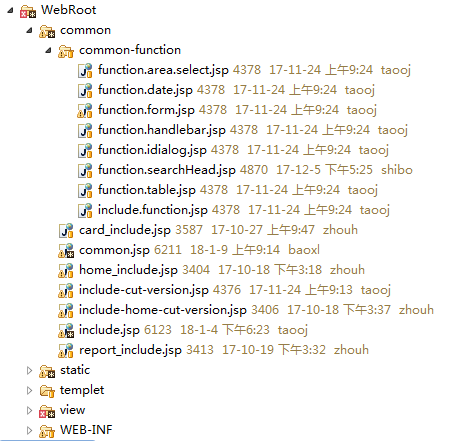
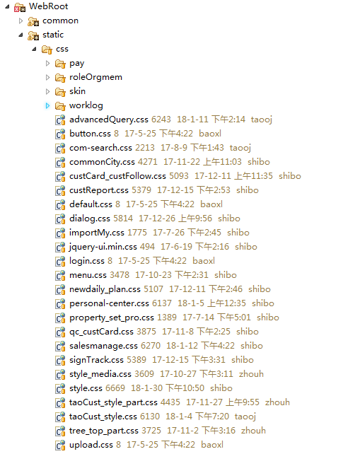
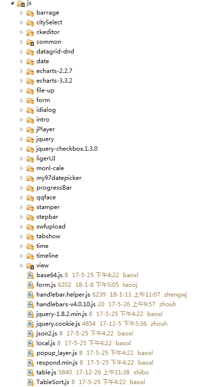
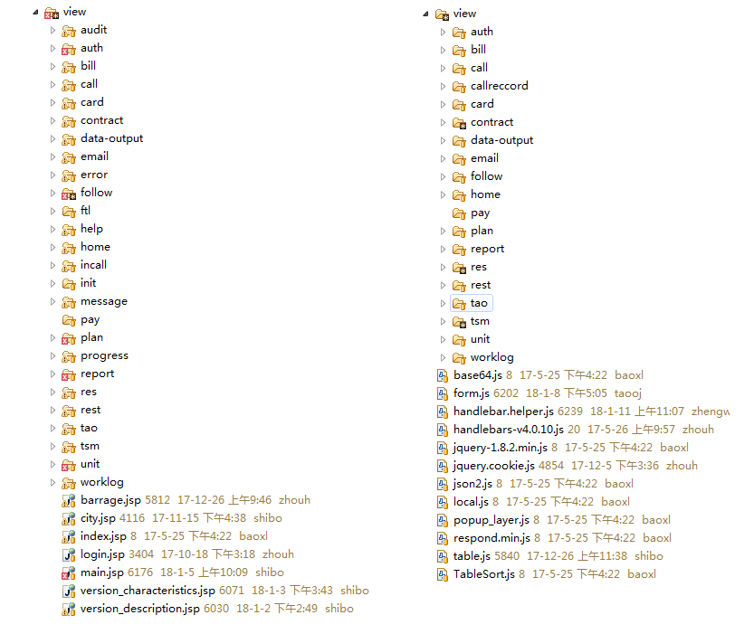

Webroot
|-- common          //公共引入的jsp页面
|-- static
    |-- css         //项目引用的样式
    |-- images      //项目引用图片
    |-- js          //1. 旧的三方包 2. view层对应的js
    |-- thirdparty  //三方包
|-- template        //项目excel下载模板
|-- view

-----

**|-- common**
-----

公共引用的jsp
1. 功能点jsp
2. 旧的功能模块jsp

用途
引入公共的css，js

将include.jsp拆解成function.xxx.jsp，为了提高页面的加载速度，避免加载不必要的css,js



**|-- static**
-----

**css:**



hyx客户端之前是ie内核，需要考虑ie8，所以很多地方的media精确到<5px级别。
后来客户端换成了chrome内核，新的模块功能，布局采用`display:flex`
hyx5.1版本，样式风格需要调整，同时改了一部分常用功能的布局。

左右，左中右布局，经5.1版本，基本项目都是通过`display:flex`实现
但是，类似`工作日志`模块
左侧日历栏固定宽度，右侧通过media query识别当前分辨率，固定右侧宽度
当前项目套了多个容器，多个容器里面都通过@media去控制容器的宽度。所以，不太好维护。

**建议**
新项目中，尽量用`display:flex`去布局（IE10+）
其次，用`css3 calc()`（IE9+）
再次，用media query，尽量避免多个容器嵌套使用，改革尺寸维护起来不方便

**images**

没有层级概念，所有图片都在该目录下面

**js**



easyui
-----

现在主要用到2个功能，tabs和tree
[easyui-tabs](http://www.jeasyui.net/plugins/160.html)
```javascript
$('#tt').tabs(Object);
```
[easyui-tree](http://www.jeasyui.net/plugins/185.html)
```javascript
$('#tt').tree(Object);
```

my97datepicker
-----

[my97datepicker官方文档](http://www.my97.net/demo/index.htm)
```javascript
WdatePicker(Object)
```

项目中，大部分代码都以

```html
<input type="text" id="actionDate" onclick="WdatePicker({dateFmt:'yyyy-MM-dd HH:mm:ss',maxDate:'%y-%M-%d'})"  class="ipt"  checkProp="chk_" readOnly="readonly"/>
```
这种形式存在。

jquery-daterangepicker
-----

没能找到很好版本的文档。此文档看着挺累，东西倒也是完整的。若有找到好的文档，通知我下
[jquery-daterangepicker](https://jingyan.baidu.com/article/48a42057edfaa0a92525046a.html)

```
$('#dom-id')
.dateRangePicker()
.bind('datepicker-change',function(event,obj){
  console.log(obj);
  // obj will be something like this:
  // {
  //    date1: (Date object of the earlier date),
  //    date2: (Date object of the later date),
  //    value: "2013-06-05 to 2013-06-07"
  // }
})
.bind('datepicker-apply',function(event,obj){
  console.log(obj);
})
.bind('datepicker-close',function(){
  console.log('close');
});        
```
|方法名|参数|描述|
|-|
|format| (String)|Moment的日期格式。|
|separator| (String)|日期字符串之间的分隔符。|
|language| (String)|预定义的语言是"en"和"cn"。你可以使用这个参数自定义语言。也可以设置为"auto"来让浏览器自己检测语言。|
|startOfWeek| (String)|"sunday" 或 "monday"。|
|getValue| (Function)|当从DOM元素中获取日期范围时会调用该函数，函数的上下文被设置为datepicker DOM。|
|setValue| (Function)|当向DOM元素中写入日期范围时调用该函数。|
|startDate| (String or false)|定义用户允许的最早日期，格式和format相同。|
|endDate| (String or false)|定义用户允许的最后日期，格式和format相同。|
|minDays| (Number) |该参数定义日期范围的最小天数，如果设置为0，表示不限制最小天数。|
|maxDays| (Number)|该参数定义日期范围的最大天数，如果设置为0，表示不限制最大天数。|
|showShortcuts| (Boolean) |先生或隐藏shortcuts区域。|
|time| (Object)|如果允许该参数就会添加时间的范围选择。|
|shortcuts| (Object)|定义快捷键按钮。|
|customShortcuts| (Array)|定义自定义快捷键按钮。|
|inline| (Boolean)|使用inline模式渲染该日期选择器，而不是overlay模式。如果设置为true，则要一起设置container参数。|
|container| (String, css selector 或者 DOM Object) |要进行渲染的日期选择器DOM元素。|
|alwaysOpen| (Boolean)|如果使用inline模式，你可能希望在页面加载时就渲染日期选择器。该参数设置为true时会隐藏"close"按钮。|
|singleDate| (Boolean)|设置为true可以选择单个的日期。|
|batchMode| (false / 'week' / 'month')|自动批处理模式。|


handlebars
-----

[handlebars.js官网](http://handlebarsjs.com/)
[handlebars.js中文文档](http://keenwon.com/992.html)

项目中，已将handlebar独立出来，如果jsp中需要用到，只需要引入function.handlebar.jsp即可
```
<%@ include file="/common/common-function/function.handlebar.jsp"%>
```

function.handlebar.jsp
```
<script type="text/javascript" src="${ctx}/static/js/handlebars-v4.0.10.js${_v}"></script>
<script type="text/javascript" src="${ctx}/static/js/handlebar.helper.js${_v}"></script>
```


渲染表格数据，render_table.js，其中包含分页信息、表格加载过程loading、表格渲染
其中使用handlebars渲染部分的代码如下:
render_table.js
```javascript
function renderTable(data){
  //使用Handlebars.compile编译模板
	var myTemplate = Handlebars.compile($("#template").html());
  //传入数据，渲染页面表格
	$(".ajax-table>tbody").html(myTemplate(data));
}
```
页面部分
```
<script type="text/x-handlebars-template" id="template">
{{#each list}}
<tr class="{{even_odd @index}}" data-custid="{{custId}}" data-followid="{{followId}}" >
  <td style="width:30px;">
    <div class="overflow_hidden w30 skin-minimal">
      <input type="checkbox" data-sale-chanceid="{{saleChanceId}}" />
    </div>
  </td>
  <td style="width:130px;">
    <div class="overflow_hidden w80 link">
    {{saleChanceBtn ../isState custId custName company saleChanceId ../shareAccs}}
    </div>
  </td>
  {{#if ../isState}}
    <td>
      <div class="overflow_hidden w100" title="{{custName }}">{{custName }}</div>
    </td>
  {{else}}
    <td>
      <div class="overflow_hidden w100" title="{{custName }}">{{custName }}</div>
    </td>
    <td>
      <div class="overflow_hidden w100" title="{{company }}">{{company }}</div>
    </td>
  {{/if}}
  <td>
    <div class="overflow_hidden w80" title="{{formatDate theorySignDate 'YYYY-MM-DD' }}">{{formatDate theorySignDate 'YYYY-MM-DD' }}</div>
  </td>
  <td>
    <div class="overflow_hidden w50" title="{{saleChanceRate theorySuccessRate }}">{{saleChanceRate theorySuccessRate }}</div>
  </td>
  <td>
    <div class="overflow_hidden w50" title="{{#compare isFollow '==' '0'}}跟进中{{else}}作废{{/compare}}" data-isfollow="{{#compare isFollow '==' '0'}}true{{else}}false{{/compare}}">{{#compare isFollow '==' '0'}}跟进中{{else}}作废{{/compare}}</div>
  </td>
</tr>
{{/each}}
/**
 *  单一对象比较
 *  详见handlebar.helper.js
 *
 *  {{#compare people.name '==' 'peter'}}
      他的名字是peter
    {{else}}
      他的名字不是peter
    {{/compare}}
 *
 *
 */
</script>
```

echarts
-----

[echarts官方文档](http://echarts.baidu.com/tutorial.html#5%20%E5%88%86%E9%92%9F%E4%B8%8A%E6%89%8B%20ECharts)

```html
<!DOCTYPE html>
<html>
<head>
    <meta charset="utf-8">
    <title>ECharts</title>
    <!-- 引入 echarts.js -->
    <script src="echarts.min.js"></script>
</head>
<body>
    <!-- 为ECharts准备一个具备大小（宽高）的Dom -->
    <div id="main" style="width: 600px;height:400px;"></div>
    <script type="text/javascript">
        // 基于准备好的dom，初始化echarts实例
        var myChart = echarts.init(document.getElementById('main'));

        // 指定图表的配置项和数据
        var option = {
            title: {
                text: 'ECharts 入门示例'
            },
            tooltip: {},
            legend: {
                data:['销量']
            },
            xAxis: {
                data: ["衬衫","羊毛衫","雪纺衫","裤子","高跟鞋","袜子"]
            },
            yAxis: {},
            series: [{
                name: '销量',
                type: 'bar',
                data: [5, 20, 36, 10, 10, 20]
            }]
        };

        // 使用刚指定的配置项和数据显示图表。
        myChart.setOption(option);
    </script>
</body>
</html>
```

ckeditor
-----

[ckeditor官方文档]https://docs.ckeditor.com/
项目中现在的功能基本满足需求，有特殊需求再看文档增删改功能吧

form.js
-----

表单头部查询功能公共js
元老级别js，各种代码堆叠，导致新的功能各种添加class，在js底部添加各种js代码实现功能。

|-- view
-----


基本上，相应的功能门口的一个view对于static-view下面一个相应的文件夹

**难点**
1. 功能点找不到相应的页面
2. 找到了页面，不知道其对应的js
3. 找到了问题在某个公共的js里，又下不了手改里面的内容，怕影响其他模块本身正常的功能
4. 为了解决问题，`ctrl+c`，`ctrl+v`，弄出一份新的js
5. 维护起来，全局搜索某个字段，一改就是好多个js
6. 同样的代码，在标准版，慧拨还得一模一样改一遍。容易遗漏不说，改的脑壳痛。

前后端数据交互
-----
1. 异步请求，返回json，前端自己渲染页面内容
返回页面，并且返回json格式数据。前端自己将json中的数据，渲染至页面
2. 同步
后台将页面里的数据渲染好后，整个页面返回

hyx这个项目，初期所有的页面都是同步的，经几个版本更新，也只是将部分功能（主要是列表）改成异步。

举个例子，慧营销-我的客户

数据提交
-----
1. form submit
```javascript
document.form[0].submit()
```

2. ajax
```javascript
$.ajax({
  type: get/post,
  url: xxxxx,
  data: {},//form.serialize()
  success: function(){},
  error: function(){}
})
```
